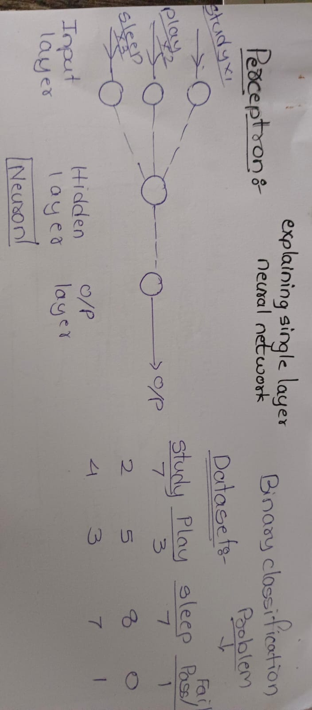

# Deep Learning Overview

## 1. Perceptron
A **Perceptron** is the basic computational unit of an Artificial Neural Network (ANN).  
- It is used to **solve binary classification problems**.  
- A perceptron creates a **linear decision boundary** to separate data points.  
- This makes it a **linear classifier**.

**Advantages:**  
- Solves **binary classification** problems efficiently.  
- Works well for **linearly separable data**.  

**Disadvantages:**  
- Cannot handle **non-linear datasets**.  

---

## 2. Multi-Layer Perceptron (MLP)
A **Multi-Layer Perceptron (MLP)**, also known as an **Artificial Neural Network (ANN)**, is an extension of the perceptron with **multiple layers**.  
It consists of an **input layer, hidden layers, and an output layer**.

### Key Components:
1. **Forward Propagation** – Input is passed through the layers to get an output.  
2. **Backward Propagation (Backpropagation)** – Adjusts weights to minimize error.  
   - **Geoffrey Hinton** is known as a **pioneer of Deep Learning**.  
3. **Loss Function** – Measures error between prediction and actual output.  
4. **Activation Function** – Adds non-linearity to help the model learn complex patterns.  
5. **Optimizer** – Updates weights to **minimize the loss function**.

---

## 3. Neuron
A **Neuron** receives multiple inputs, multiplies them by weights, sums them, and passes the result through an **activation function** to decide the output.

**Hidden Layer Computation:**  
1. **Net Value (Weighted Sum):**  
   \[
   Net = \sum (X_i \times W_i) + Bias
   \]  
2. **Activation Function:**  
   Determines if the neuron is activated or not.

---

## 4. Bias in Neural Networks
- **Bias** is an extra parameter that helps the model shift the activation function.  
- **Why needed?**  
  - If weights are initialized as zero, the output will also be zero.  
  - Bias allows neurons to **learn better patterns** even with zero weights.

---

## 5. Summary
- **Perceptron:** Solves linear binary classification problems.  
- **MLP (ANN):** Multi-layer architecture for complex tasks.  
- **Neuron:** Basic processing unit with weighted sum + activation function.  
- **Bias:** Prevents neurons from being always zero and improves learning.

---

### Tags
`deep-learning` `artificial-neural-network` `perceptron`  
`multi-layer-perceptron` `activation-function` `optimizer`  
`backpropagation` `machine-learning` `beginner-friendly`
